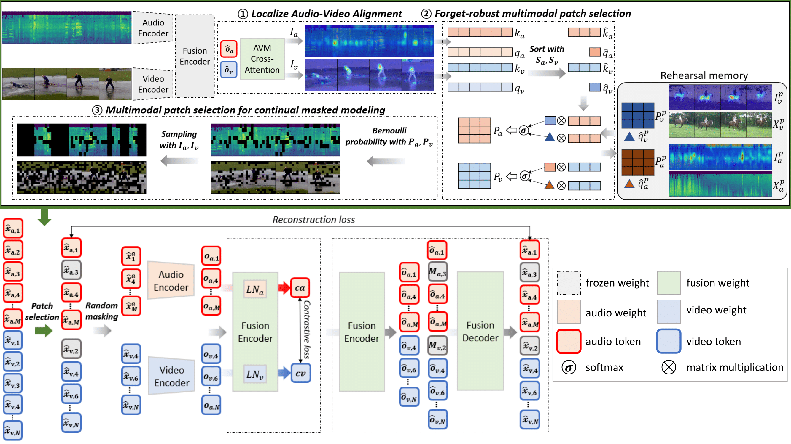

# FLAVA

### **Lifelong Audio-video Masked Autoencoder with Forget-robust Localized Alignments**  
* Authors: Jaewoo Lee*, [Jaehong Yoon*](https://jaehong31.github.io/), [Wonjae Kim](https://wonjae.kim/), [Yunji Kim](https://github.com/YunjiKim), [Sung Ju Hwang](http://www.sungjuhwang.com/)
* [Paper](https://arxiv.org/abs/2310.08204)
* [Project Page](https://g-jwlee.github.io/FLAVA/)

## Introduction

In real-world scenarios, the model should handle a dynamic shift of audiovisual data distribution when training on videos, as the agent's surroundings can continuously chnage over time.

We propose FLAVA (Forget-robust Localized Audio-Video Alignment), which captures the complex relationships between the audio and video modalities during training on a sequence of pre-training tasks while alleviating the forgetting of learned audiovisual correlations.


<p>
Our method harnesses cross-modal attention maps from the AVM module to compute importance scores in order to identify highly correlated patches <b>(Localized Audio-Video Alignment)</b>.
              Comparing the attention maps created by the current queries with those generated by past queries, we generate pruning probability matrices that compare the relative importance of
              each patch between the current task and past tasks <b>(Forget-robust multimodal patch selection)</b>. Finally, we select patches to continually pre-train the model <b>(Multimodal patch selection for continual masked modeling)</b>.
</p>

## Install
### Setup `python` environment
```
conda create -n FLAVA python=3.7
```

### Install `pytorch`, `torchvision`, and `torchaudio`
The following version have been tested.  
* `torch  1.9.1`
* `torchvision  0.14.1` 
* `torchaudio  0.9.1`  

You can try other version of `pytorch` but make sure that it will be compatible with your `cuda` and `cudnn`.  

### Install other dependencies
```
pip install -r requirements.txt
```

## Dataset
We refer [CAV](https://github.com/YuanGongND/cav-mae) to consist datasets for our experiments. Download .json files of the VGGSound and AudioSet datasets.<br>
Place the downloaded files in /dataset_path/vggsound/data and /dataset_path/AudioSet/data, respectively.

### VGGSound

1. Follow the instruction in [audiosetdl](https://github.com/speedyseal/audiosetdl) to download the VGGSound dataset.
2. Move current directory to /tools/vggsound/data_preprocess
3. Run ```python add_category_info_vggsound.py``` to add category information.
4. Run ```python json2csv_vggsound.py``` to change .json files into .csv files.
5. Run ```python split_vggsound.py``` to split the dataset into subset datasets.
6. Run ```python valid_clip_vggsound.py``` to find valid clips of the VGGSound.
7. Run ```python extract_audio.py``` & ```python extract_video_freame.py``` to extract audio & video from the clips.

### AudioSet

1. Follow the instruction in [audioset-processing](https://github.com/aoifemcdonagh/audioset-processing) to download all the required class datasets in the AudioSet dataset.<br>
   When downloading the samples, exclude samples that are included in more than two different categories.
2. Move current directory to /tools/vggsound/data_preprocess
3. Run ```python retrieval_task_audioset.py``` to consist .csv file for the AudioSet retrieval task.
3. Follow the instruction in [audiosetdl](https://github.com/speedyseal/audiosetdl) and the .csv file in 2. to download samples for the retrieval task.
4. Run ```python add_category_info_audioset.py``` to add category information.
5. Run ```python split_audioset.py``` to split the dataset into subset datasets.
6. Run ```python cl_train_test_audioset.py``` to follow the same format of the train/test VGGSound .csv files.
7. Run ```python cl_retrieval_audioset.py``` to follow the same format of the retrieval VGGSound .csv file.
8. Run ```python extract_audio.py``` & ```python extract_video_freame.py``` to extract audio & video from the clips.

## Training

### Pretraining
```
bash commands/cav_pretrain_{dataset}_base_{baseline}.sh [environment & hyperparameters]
```

### Finetuning (Classification)

```
bash commands/cav_finetune_{dataset}_base.sh [environment & hyperparameters]
```

## Bibtex
```
@misc{lee2023lifelong,
      title={Lifelong Audio-video Masked Autoencoder with Forget-robust Localized Alignments},
      author={Jaewoo Lee and Jaehong Yoon and Wonjae Kim and Yunji Kim and Sung Ju Hwang},
      year={2023},
      eprint={2310.08204},
      archivePrefix={arXiv},
      primaryClass={cs.CV}
}
```
